# RobbyMD

**Doctor-steered diagnostic trace for clinical encounters.**

> A clinical note preserves the conclusion. RobbyMD preserves the path.

> **Research prototype. Not a medical device.** RobbyMD does not diagnose, treat, prescribe, order, triage, or recommend treatment. The physician makes every clinical decision. All submitted demo data is synthetic or from published research benchmarks.

Built for the **Built with Opus 4.7 Hackathon** (Cerebral Valley x Anthropic, April 2026).

---

## What it is

RobbyMD is a live diagnostic trace substrate for doctor-patient encounters. It turns conversation into timestamped claims, correction edges, working differentials, discriminating questions, and provenance-backed SOAP drafts.

It is not a note-taker. It preserves the reasoning path behind the note.

---

## What to watch in the demo

1. The patient gives a claim.
2. RobbyMD extracts it into a structured clinical claim with source span.
3. The differential updates deterministically from active evidence.
4. The patient corrects a prior claim.
5. RobbyMD keeps both claims, marks the old one superseded, and links the correction.
6. The leading differential and next-best question change.
7. SOAP drafts only from active, provenance-backed claims.
8. The physician can inspect, upvote, downvote, or trace any claim.

---

## Why this is different

Most clinical AI demos produce a transcript, a summary, or a note.

RobbyMD builds a trace substrate:
- Claims are structured and timestamped, not free text
- Corrections are linked, not overwritten
- Excluded claims remain auditable
- Differentials are deterministic projections over active evidence, not LLM guesses
- Next questions are selected from missing discriminating evidence
- SOAP sentences must cite active claims or they are dropped
- Post-encounter agents query the trace instead of reconstructing the visit from a transcript

---

## Judge quick check

```bash
# Core invariant: same claims produce identical differential ranking
pytest tests/property/test_determinism.py -v        # 3 tests, passes

# No real patient identifiers in codebase
pytest tests/privacy/test_no_phi.py -v

# All local model dependencies license-gated
pytest tests/licensing/test_open_source.py -v       # 2 tests, passes

# Eval artifacts (verified)
wc -l eval/longmemeval/results/final_full_500_scored.jsonl   # 500
cat eval/longmemeval/results/REPRODUCTION.md                  # step-by-step rerun guide
```

**Demo replay** (requires backend running):
```bash
uvicorn src.api.server:app --host 0.0.0.0 --port 8420
# In another terminal:
cd ui && npm run dev
# Demo replays the Mr. Torres chest-pain case with 9 scripted turns
```

**Eval report paths:**
- `eval/longmemeval/results/final_full_500_scored.jsonl` (500 scored LongMemEval-S predictions)
- `eval/reports/medxpertqa/3stage/scored_baseline_full.json` (2,450 scored MedXpertQA predictions)
- `eval/longmemeval/results/REPRODUCTION.md` (exact rerun instructions)

---

## Problem

Physicians already reason. The trace is missing.

A transcript preserves what was said. A clinical note preserves what was concluded. The path between them (which answer shifted the differential, which clue was ruled down, which claim was corrected, why a specific question mattered) is reconstructed from memory after the encounter, or lost.

Example: a patient says "no allergies" at minute 2, then mentions "actually, penicillin" at minute 8. In a standard note, only the final state appears. In RobbyMD, both claims exist: the original is superseded and linked to the correction, with timestamps, speaker attribution, and the edge type (PATIENT_CORRECTION). The differential adjusts in real time. The SOAP note references the active claim. The trace is complete.

---

## Doctor-steered reasoning

RobbyMD does not replace physician reasoning. It makes the physician's existing reasoning visible and traceable.

- The physician sees all clinically relevant clues: active claims, superseded claims, excluded claims, missing evidence, and suggested questions with rationale
- The physician can inspect, accept, ignore, exclude, or correct any claim
- Excluded claims stop driving the differential but remain in the trace
- Nothing is erased. Corrections and exclusions are linked, not deleted
- SOAP is a review-ready draft, not a final document. The physician approves

---

## Design principle

Claude extracts and phrases. The substrate stores, validates, links, ranks, and preserves.

This division is intentional:
- Use Claude where language understanding matters (claim extraction, question phrasing, note drafting)
- Use deterministic substrate logic where auditability matters (supersession, differential ranking, provenance)
- Make every generated surface trace back to claims and turns
- Preserve physician control at every decision point

---

## What RobbyMD does

```
doctor-patient turn
  > timestamped transcript (ASR / direct input)
  > extracted clinical claim (Opus 4.7, structured output)
  > admission filter (reject filler, duplicates)
  > supersession check (rule-based + semantic, deterministic)
  > claim store (active / superseded / excluded, with provenance)
  > differential projection (LR-weighted, zero LLM, deterministic)
  > next-best question (deterministic selection + Opus 4.7 phrasing)
  > SOAP sentence (Opus 4.7 draft + provenance validation)
```

SOAP is downstream. The trace is the product.

---

## Architecture



### ASR / transcript pipeline
`src/extraction/asr/` — Converts audio to timestamped, diarised turns via an 8-stage pipeline: normalize, trim silence, Whisper large-v3, WhisperX alignment, pyannote diarisation, LLM cleanup, hallucination guard (5 deterministic checks), medical vocabulary correction. Models: Whisper (MIT), WhisperX (BSD), pyannote (CC-BY-4.0 weights). Tested on 7 synthetic clinical scripts.

ASR is an experimental ingestion path, not the core claim of the demo. RobbyMD's main contribution begins once timestamped turns exist: claim extraction, supersession, deterministic differential projection, provenance, and physician-steered review.

### Claim extraction
`src/extraction/claim_extractor/` — Opus 4.7 structured output with closed predicate vocabulary. Input: current turn + 2 prior turns + active claim set. Output: subject, predicate, value, confidence, source_turn_id, char_start, char_end. Six few-shot examples covering multi-claim, negation, supersession, and rare symptoms.

### Admission filter
`src/substrate/admission.py` — Rejects turns under 3 words, filler phrases, and claims with embedding similarity >= 0.95 to existing active claims. Zero LLM cost.

### Supersession


`src/substrate/supersession.py` — **Pass 1** (rule-based): same subject and predicate, different value produces a typed edge: PATIENT_CORRECTION, PHYSICIAN_CONFIRM, REFINES, or CONTRADICTS. Deterministic, no LLM.

`src/substrate/supersession_semantic.py` — **Pass 2** (semantic): e5-small-v2 local embeddings at cosine threshold 0.88. Catches paraphrased updates. Edge type: SEMANTIC_REPLACE with identity_score.

Old claims are **never deleted**. They are marked SUPERSEDED and linked to the new claim via `supersession_edges`.

### Claim store
`src/substrate/schema.py` — SQLite with 10 tables covering turns, claims, supersession edges, decisions, note sentences, embeddings, metadata, and event frames. `src/substrate/claims.py` validates every insert: source_turn_id must reference an existing turn, predicate must be in the pack's closed vocabulary. `src/substrate/projections.py` maintains 4 materialized views, one per differential branch.

### Event frames
`src/substrate/event_frames.py` — Groups co-referent claims into coherent encounter events such as symptom onset, medication history, allergy correction, risk-factor disclosure, exertional trigger, or time-linked symptom progression.

### Differential engine
`src/differential/engine.py` — For each active claim, look up matching LR table rows. Feature present: multiply by LR+. Feature absent: multiply by LR-. Sum log-likelihoods per branch, softmax, rank. Zero LLM. Deterministic. Same inputs produce identical output (property tested via `tests/property/test_determinism.py`). Latency under 50ms.

`predicate_packs/clinical_general/differentials/chest_pain/lr_table.json` — 81 features across 4 branches (Cardiac, Pulmonary, MSK, GI), 28 peer-reviewed sources with URLs. No proprietary content.

### Counterfactual verifier
`src/verifier/verifier.py` — For the top 2 branches, find refutation features (LR+ > 1.5, absent). Score each candidate by discriminative power times uncertainty. Pick argmax deterministically. One Opus 4.7 call phrases the selected discriminator in clinical language. Output: next_best_question, why_moved, missing_evidence.

### SOAP generator
`src/note/generator.py` — Groups active claims by SOAP section. Opus 4.7 drafts sentences with `[c:claim_id]` markers. Validator drops any sentence where the cited claim_id does not exist in active claims. Every surviving sentence has non-empty source_claim_ids. SOAP is review-ready, not final.

### Provenance



`src/substrate/provenance.py` — Forward and backward tracing. Claim to source turn to original transcript text and char span. Note sentence to source claims to source turns. Enforced at write time.

### API and UI
`src/api/server.py` — FastAPI + WebSocket at `/ws/{session_id}`. Event bus broadcasts every claim creation, supersession, and projection update in real time.

`ui/src/` — React + TypeScript + Tailwind + ReactFlow + Zustand. 17 components. Four panels (transcript, claim state, differential trees, SOAP note) plus auxiliary strip (why_moved, next_best_question). All bidirectionally linked: click a claim to highlight the source turn, click a SOAP sentence to highlight the source claims.

---

## Core invariants

| Invariant | How enforced | Proof |
|-----------|-------------|-------|
| Nothing disappears | Superseded/excluded claims remain in DB, linked via edges | `src/substrate/supersession.py` |
| Claims trace to source turns | `source_turn_id` FK validated at insert | `src/substrate/claims.py` |
| SOAP sentences require source claims | Validator drops orphan sentences | `src/note/generator.py` |
| Same active claims produce identical differential | Pure math, no randomness | `tests/property/test_determinism.py` (100x) |
| No real patient data | Synthetic scripts + published benchmarks only | `tests/privacy/test_no_phi.py` |
| Local models license-gated | Allowlist: MIT, Apache-2.0, BSD, MPL, ISC, LGPL | `tests/licensing/test_open_source.py` |

---

## Claude Opus 4.7 and Managed Agents



Claude extracts and phrases. The substrate stores, updates, links, validates, and preserves.

### During the live encounter

| Integration | What Opus does | What the substrate does |
|-------------|---------------|------------------------|
| Claim extraction | Structured output from turns | Validates, persists, runs supersession |
| Next-best question | Phrases the discriminator in clinical language | Selects the discriminator deterministically |
| SOAP drafting | Generates sentences with `[c:claim_id]` markers | Validates markers, drops orphan sentences |

### After the encounter: 5 Claude Managed Agents

`src/agents/orchestrator.py` uses `client.beta.agents.create()`, `client.beta.sessions.create()`, and `client.beta.environments.create()`. Fallback to `client.messages.create()` with tool_use loop for offline testing.

| Agent | Purpose | Status |
|-------|---------|--------|
| Doctor Aftercare | Doctor queries the substrate post-visit | Implemented, requires API key, not submission-live-tested |
| Patient Aftercare | Patient asks questions with provenance-backed answers | Implemented, requires API key, not submission-live-tested |
| Shift Handoff | Structured handoff when physician changes | Implemented, requires API key, not submission-live-tested |
| Diagnostic Bias Monitor | Flags anchoring bias and premature closure | Implemented, requires API key, not submission-live-tested |
| Clinical Note Co-Author | Interactive note editing preserving provenance | Implemented, requires API key, not submission-live-tested |

All agents query the same substrate: turns, claims, supersession edges, differential state, note sentences, and provenance links. They do not reconstruct the visit from a transcript. They read the trace.

---

## Token efficiency



Most of the reasoning pipeline uses zero API tokens.

| Component | Tokens | Compute |
|-----------|--------|---------|
| Retrieval (sentence-transformers + BM25) | 0 | Local |
| Supersession Pass 1 (rule-based) | 0 | Local |
| Supersession Pass 2 (e5-small-v2) | 0 | Local |
| Evidence verification (heuristic) | 0 | Local |
| Differential engine (LR math) | 0 | Local, under 50ms |
| Admission filter (local embeddings) | 0 | Local |
| Claim extraction | ~800/turn | Opus 4.7 |
| Next-best question | ~200/shift | Opus 4.7 |
| SOAP note | ~2K/note | Opus 4.7 |

**Benchmark cost proof:**

| Benchmark | Questions | Total cost | Per correct answer |
|-----------|-----------|-----------|-------------------|
| LongMemEval-S | 500 | $10.21 | $0.023 |
| MedXpertQA | 2,450 | ~$29 | $0.020 |

---

## Evaluation

These benchmarks do not validate RobbyMD as a clinical tool. They test narrow capabilities used by the system: memory lifecycle and update handling, expert medical QA reasoning, and retrieval cost behavior. They do not prove clinical safety, real-world diagnostic accuracy, physician satisfaction, or patient outcome impact.

### LongMemEval-S (ICLR 2025): memory lifecycle

LongMemEval-S (Wu et al., [arXiv 2410.10813](https://arxiv.org/abs/2410.10813)) tests five memory abilities: information extraction, multi-session reasoning, temporal reasoning, knowledge updates, and abstention. 500 questions, GPT-4o judge.

**Published systems:**

| System | Score | Source |
|--------|-------|--------|
| Mastra OM | 94.9% | mastra.ai/research |
| Mem0 | 93.4% | arXiv 2504.19413 |
| EverMemOS | 83.0% | arXiv 2601.02163 |
| TiMem | 76.9% | arXiv 2601.02845 |
| Zep/Graphiti | 71.2% | arXiv 2501.13956 |
| Full-context GPT-4o | 64.0% | Wu et al. 2025 |

**Our run: 442/500 (88.4%)**

| Category | Score |
|----------|-------|
| single-session-user | 69/70 (98.6%) |
| single-session-assistant | 55/56 (98.2%) |
| knowledge-update | 73/78 (93.6%) |
| abstention | 27/30 (90.0%) |
| temporal-reasoning | 117/133 (88.0%) |
| multi-session | 106/133 (79.7%) |
| single-session-preference | 22/30 (73.3%) |

Reader: GPT-5-mini. Judge: GPT-4o-2024-11-20. Cost: $10.21. Improvements: temporal context (question_date + relative offsets), dense+BM25 hybrid retrieval, chain-of-thought reading.

Full reproduction: `eval/longmemeval/results/REPRODUCTION.md`

### MedXpertQA Text (ICML 2025): expert medical reasoning

MedXpertQA (Zuo et al., [arXiv 2501.18362](https://arxiv.org/abs/2501.18362)) tests expert-level medical reasoning across 17 specialties. 10-option MCQ, 2,450 questions. Random baseline is 10%.

**Published systems:**

| System | Score | Source |
|--------|-------|--------|
| GPT-5 | ~56% | arXiv 2508.08224 |
| Human expert (pre-licensed) | ~43% | Zuo et al. 2025 |
| DeepSeek-R1 | 37.8% | Zuo et al. 2025 |
| o3-mini | 37.3% | Zuo et al. 2025 |
| GPT-4o | ~30% | Zuo et al. 2025 |

**Our run (all 2,450 cases):**

| Variant | Correct | Accuracy |
|---------|---------|----------|
| Opus 4.7 baseline | 1,354/2,450 | 55.3% |
| Opus 4.7 + BM25 RAG | 1,454/2,450 | 59.3% |

RAG details: 312 cases helped, 212 hurt, net +100. Knowledge base: 10,178 MedQA-USMLE training pairs (Apache-2.0). Zero MedXpertQA data in retrieval. Cost: ~$29 via Anthropic Batch API.

### ACI-Bench (Nature Sci Data 2023)

Harness built. Adapter and baseline/full variants ready. Full-run numbers pending.

---

## Known risks, handled honestly

| Risk | Current handling |
|------|------------------|
| Clinical overreach | Research prototype. Physician approval required. No autonomous diagnosis or treatment |
| Hallucinated note content | SOAP validator drops sentences without active claim citations |
| Corrections lost in final note | Superseded claims remain linked, not deleted |
| Non-deterministic ranking | Differential engine is deterministic and property-tested (100x) |
| ASR speaker errors | ASR is experimental. Core demo can replay timestamped scripted turns |
| Agent overreach | Agents query the trace substrate and are gated by physician review |

---

## Safety, privacy, and limits

- The submitted prototype uses **synthetic and anonymized data only**. No real patient data is required or used.
- Encounter state is local to the current session unless explicitly persisted for replay or evaluation.
- RobbyMD is a **research prototype, not a medical device**.
- It has not been clinically validated, prospectively tested, or approved for clinical use.
- The physician makes every clinical decision. RobbyMD does not diagnose, prescribe, order, triage, or treat.
- SOAP output is a review-ready draft that requires physician approval.
- Patient-facing outputs (aftercare agents) require physician approval and are clearly non-diagnostic.
- Local open-source models (Whisper, WhisperX, pyannote, e5-small-v2) are license-gated via `tests/licensing/test_open_source.py`. Claude Opus 4.7 is used through API calls as the hackathon's sponsored model.
- Production deployment would require clinical validation, security review, regulatory assessment, and institutional approval.
- The system is designed with a non-device CDS posture in mind (physician reviewable, no autonomous action, supports but does not replace reasoning). This is an architectural intent, not a regulatory conclusion.

---

## What to judge

Judge RobbyMD on:
1. Whether correction history is preserved instead of overwritten
2. Whether differential movement is traceable to active evidence
3. Whether next-best questions come from missing discriminating evidence
4. Whether SOAP sentences are provenance-backed
5. Whether the physician can steer claims instead of accepting opaque model output
6. Whether the architecture separates language generation from auditable state

Do not judge it as a clinically validated product. It is a research prototype.

---

## How to run

```bash
# Backend
pip install -r requirements.txt
uvicorn src.api.server:app --host 0.0.0.0 --port 8420

# Frontend
cd ui && npm install && npm run dev

# Tests
pytest tests/property/test_determinism.py -v
pytest tests/licensing/test_open_source.py -v
pytest tests/privacy/test_no_phi.py -v

# LongMemEval-S evaluation (requires OPENROUTER_API_KEY)
ACTIVE_PACK=personal_assistant python -m eval.longmemeval.final_runner --phase all --workers 10
```

---

## Repository structure

| Directory | Contents |
|-----------|----------|
| `src/substrate/` | Claim store, supersession, provenance, event frames, projections |
| `src/extraction/asr/` | 8-stage ASR pipeline (experimental ingestion) |
| `src/extraction/claim_extractor/` | Opus 4.7 structured claim extraction |
| `src/differential/` | Deterministic LR-weighted differential engine |
| `src/verifier/` | Counterfactual discriminator and next-best question |
| `src/note/` | SOAP generator with provenance validation |
| `src/agents/` | 5 Claude Managed Agents and orchestrator |
| `src/aftercare/` | Red flags, escalation store, patient aftercare package |
| `src/api/` | FastAPI + WebSocket server |
| `ui/src/` | React + ReactFlow + Zustand frontend |
| `predicate_packs/` | Clinical content (chest pain: 81 LR features, 28 sources) |
| `eval/` | LongMemEval-S, MedXpertQA, ACI-Bench harnesses and results |
| `tests/` | Determinism, privacy, licensing, e2e tests |

---

## Limitations

- **Synthetic demo only.** Not tested on real clinical encounters or real audio.
- **Single complaint seeded.** Chest pain has 4 branches and 81 LR features. Other complaints (abdominal pain, dyspnea, headache) are schema-ready stubs without LR tables.
- **ASR not real-mic tested.** Pipeline verified on synthetic pyttsx3-generated audio only.
- **Managed Agents not live-tested in submission.** Code complete with real Anthropic API calls. Requires API key to run.
- **Benchmark results reflect eval-time reader models** (GPT-5-mini for LongMemEval, Opus 4.7 for MedXpertQA), not the live encounter extraction pipeline.
- **No prospective clinical validation.** Evaluation is on published research benchmarks, not clinical outcomes.
- **Preference questions remain weak** at 73.3% on LongMemEval (hardest category).
- **Diarisation error rate is high** at 57.7% on synthetic clips. Speaker attribution needs work.

---

RobbyMD is the doctor-steered diagnostic trace behind the clinical note.
