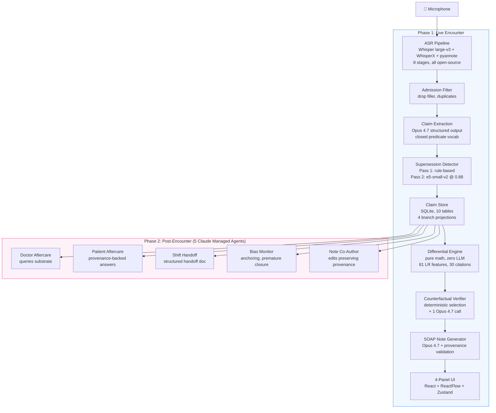
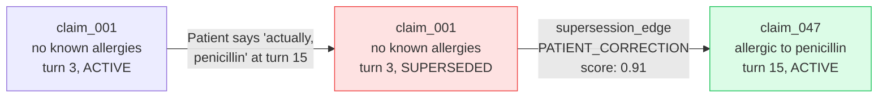
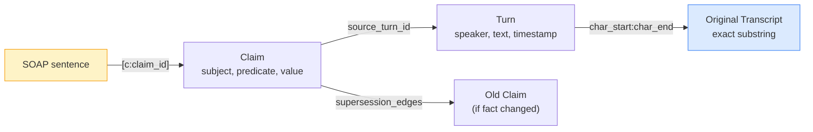
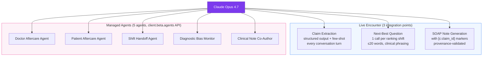

# Architecture Diagrams (Mermaid source for rendering)

## 1. Full Pipeline

## 2. Supersession Model

## 3. Provenance Chain

## 4. Opus 4.7 Integration Map

## 5. Evaluation Comparison (text for bar chart rendering)

### LongMemEval-S (memory lifecycle)
- Mastra OM: 94.9%
- Mem0: 93.4%
- **RobbyMD: 88.4%**
- EverMemOS: 83.0%
- TiMem: 76.9%
- Zep/Graphiti: 71.2%
- Full-context GPT-4o: 64.0%

### MedXpertQA Text (expert medical reasoning, 10-way MCQ)
- **RobbyMD (Opus 4.7 + RAG): 59.3%**
- GPT-5: ~56%
- **RobbyMD (Opus 4.7 baseline): 55.3%**
- Human expert: ~43%
- DeepSeek-R1: 37.8%
- o3-mini: 37.3%
- GPT-4o: ~30%
- Claude 3.5 Haiku: 17.8%
